# SwipeFlix RAG Architecture

## System Architecture Diagram

```mermaid
flowchart TB
    subgraph Frontend["🎬 SwipeFlix Frontend"]
        UI[Swipe UI]
        Chat[CineBot Chat]
    end

    subgraph API["FastAPI Backend"]
        Routes[API Routes]
        RAGRoutes[RAG Routes]
        Guard[Guardrails]
    end

    subgraph RAG["RAG Pipeline"]
        Retriever[Movie Retriever]
        Generator[RAG Generator]
        VectorDB[(FAISS Index)]
    end

    subgraph LLM["LLM Service"]
        GeminiClient[Gemini Client]
        RateLimiter[Rate Limiter]
        Cache[(Response Cache)]
    end

    subgraph Prompts["Prompt Engine"]
        ZeroShot[Zero-Shot]
        FewShot[Few-Shot]
        CoT[Chain-of-Thought]
        Meta[Meta-Prompt]
    end

    subgraph Data["Data Layer"]
        Movies[(movies.csv)]
        Ratings[(ratings.csv)]
        EvalData[(eval.jsonl)]
    end

    subgraph Monitoring["Monitoring & Observability"]
        Prometheus[Prometheus]
        Grafana[Grafana]
        MLflow[MLflow]
    end

    UI --> Routes
    Chat --> RAGRoutes
    Routes --> Guard
    RAGRoutes --> Guard
    Guard --> Retriever
    Retriever --> VectorDB
    VectorDB --> Generator
    Generator --> GeminiClient
    GeminiClient --> RateLimiter
    RateLimiter --> Cache

    Generator --> ZeroShot
    Generator --> FewShot
    Generator --> CoT
    Generator --> Meta

    VectorDB -.-> Movies
    Routes -.-> Ratings
    Prompts -.-> EvalData

    API --> Prometheus
    GeminiClient --> Prometheus
    Guard --> Prometheus
    Prometheus --> Grafana
    Generator --> MLflow
```



## Data Flow Diagram


## Ingestion Pipeline


## Guardrails Architecture


## Component Details

### RAG Pipeline Components

| Component         | Description                     | Location                         |
| ----------------- | ------------------------------- | -------------------------------- |
| Document Ingester | Loads and indexes movie data    | `src/swipeflix/rag/ingest.py`    |
| Movie Retriever   | Semantic search over documents  | `src/swipeflix/rag/retriever.py` |
| RAG Generator     | Combines retrieval + generation | `src/swipeflix/rag/generator.py` |

### LLM Components

| Component     | Description                | Location                             |
| ------------- | -------------------------- | ------------------------------------ |
| Gemini Client | API client with caching    | `src/swipeflix/llm/gemini_client.py` |
| Rate Limiter  | Free tier quota management | `src/swipeflix/llm/rate_limiter.py`  |

### Prompt Strategies

| Strategy         | Use Case                      | Location                            |
| ---------------- | ----------------------------- | ----------------------------------- |
| Zero-Shot        | Simple queries, low latency   | `experiments/prompts/strategies.py` |
| Few-Shot         | Consistent format, quality    | `experiments/prompts/strategies.py` |
| Chain-of-Thought | Complex reasoning             | `experiments/prompts/strategies.py` |
| Meta-Prompt      | Production, structured output | `experiments/prompts/strategies.py` |

### Guardrails

| Filter               | Purpose                     | Location                              |
| -------------------- | --------------------------- | ------------------------------------- |
| PII Filter           | Detect/redact personal info | `src/swipeflix/guardrails/filters.py` |
| Injection Filter     | Block prompt attacks        | `src/swipeflix/guardrails/filters.py` |
| Toxicity Filter      | Content moderation          | `src/swipeflix/guardrails/filters.py` |
| Hallucination Filter | Verify grounding            | `src/swipeflix/guardrails/filters.py` |

## API Endpoints

### RAG Endpoints

```
POST /rag/query          - RAG Q&A with sources
POST /rag/blurb          - Generate movie blurb
POST /rag/summarize-reviews - Summarize reviews
POST /rag/extract-structured - Extract structured data
POST /rag/rationale      - Generate recommendation rationale
GET  /rag/search         - Semantic movie search
GET  /rag/health         - RAG service health
GET  /rag/rate-limit     - Rate limit status
```

### A/B Testing

```
GET /rag/ab-test/{experiment} - Get variant assignment
GET /rag/ab-test-config       - Get experiment config
```

## Deployment

### Local Development

```bash
make rag  # Full pipeline: ingest + start server
```

### Docker

```bash
docker build -f Dockerfile.rag -t swipeflix:rag .
docker run -p 8000:8000 -e GEMINI_API_KEY=xxx swipeflix:rag
```

### Docker Compose

```bash
docker-compose --profile dev up
```

## Monitoring

Access dashboards at:

- Grafana: http://localhost:3000 (LLMOps Dashboard)
- Prometheus: http://localhost:9090
- MLflow: http://localhost:5000
